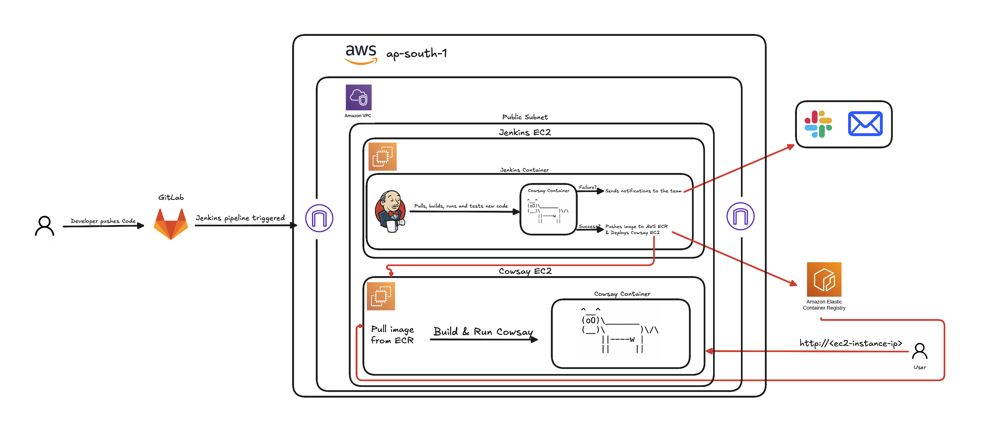

# Cowsay Pipeline

Declarative Jenkins pipeline for a Node.js application. Covers the full CI/CD cycle: build, test, push to AWS ECR, and deploy to EC2 via SSH. Includes email and Slack notifications.



---

## Pipeline Stages

```
Build Image -> Sanity Test -> Push to ECR -> Deploy to EC2
```

| Stage | What it does |
|---|---|
| Build Image | Builds Docker image tagged with `v-{BUILD_NUMBER}` |
| Sanity Test | Runs the container locally, curls the app to verify it responds |
| Push to ECR | Authenticates to AWS ECR and pushes the image |
| Deploy to EC2 | SCPs `docker-compose.yml` to the server, SSHs in, pulls and restarts |

---

## Jenkinsfile Highlights

**SCM polling** triggers a build every minute on any detected change:
```groovy
triggers {
    pollSCM("* * * * *")
}
```

**Sanity test with guaranteed cleanup** via `post { always }`:
```groovy
post {
    always {
        sh "docker rm -f sanity-test || true"
    }
}
```

**SSH deployment** uses a stored Jenkins credential to SCP the compose file and restart via Docker Compose:
```groovy
withCredentials([sshUserPrivateKey(credentialsId: SSH_CRED_ID, ...)]) {
    sh "scp -i \$SSH_KEY docker-compose.yml ..."
    sh "ssh -i \$SSH_KEY ... 'docker-compose up -d'"
}
```

**Committer-aware notifications** resolve the author email from git history and send both email and Slack alerts:
```groovy
def authorEmail = sh(returnStdout: true, script: "git show -s --format='%ae'").trim()
mail to: authorEmail, subject: "Build Success: ..."
slackSend color: 'good', channel: '#ariel-jenkins', message: "..."
```

---

## Jenkins Configuration

Credentials required:

| ID | Type | Purpose |
|---|---|---|
| `deploy-server-key` | SSH private key | Access to EC2 deploy target |

Global environment variables required:

| Variable | Purpose |
|---|---|
| `AWS_ACCOUNT_ID` | Used to construct the ECR registry URL |
| `AWS_REGION` | Region for ECR login and push |
| `DEPLOY_SERVER_IP` | IP of the EC2 deployment target |

---

## Application

Node.js app serving random quotes on port 8080.

```bash
docker build -t cowsay-pipeline .
docker run --rm -p 8080:8080 cowsay-pipeline
```
